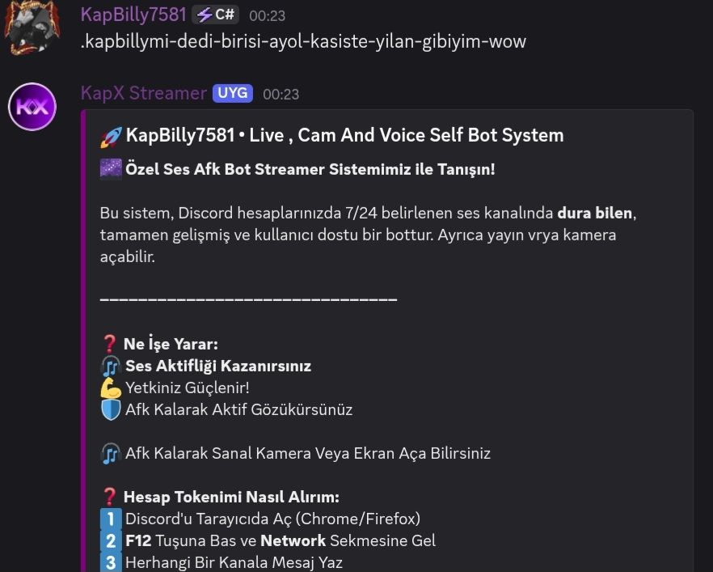
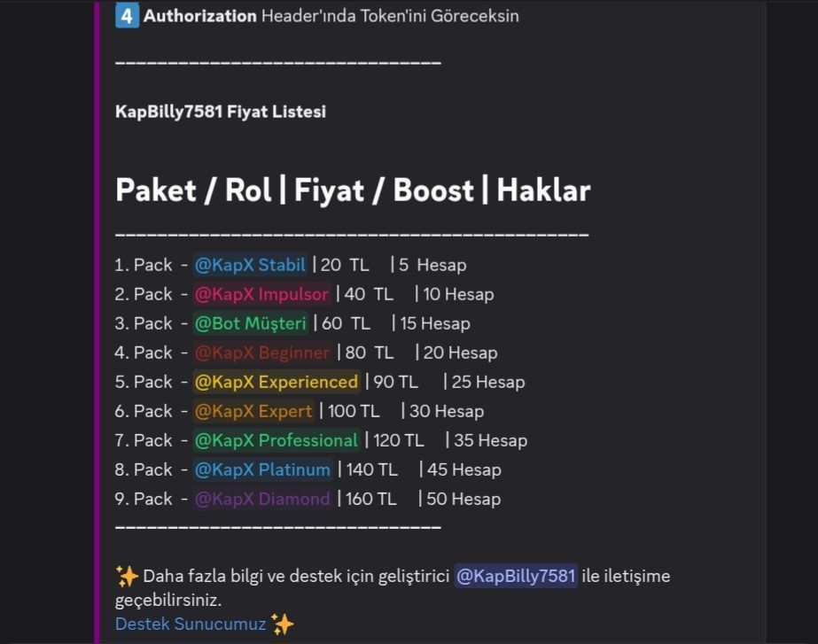
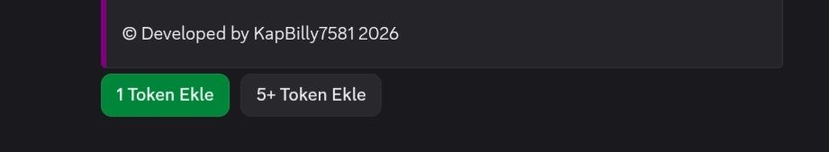

# KapBilly7581 Streamer 1.0.0

## 📜 Not 📜

- Projede /KapBilly7581-Streamer-main/Streamer/ klasöründe videos.json , polyfill.js ve main.js (main.js güncellendi data base ye uyumlu hale geldi) [Wraiths](https://youtube.com/@wraithsdev) Wraiths'ye ait.
- Kötü amaclı yazılım yoktur tüm kodlar public bir şekilde bu proje bedava şekildedir satılamaz.
- Proje Mit lisans ile korunmaktadır eğer izinsiz kod dosyalarini değiştirip yayınlanırsa telif hakkı ile cezalandırılır tazminata kadar da yolu vardır.

# 🛠️ Kurulum 🛠️

- [NodeJs](https://nodejs.org/en/download) İndir ve kur.
- Projeyi Zip olarak bilgisayarınıza indirin ve açın.
- /KapBilly7581-Streamer/KapBilly7581/ bu dosyada config.js yi istenilen gibi doldurun. Ardından /KapBilly7581_Kodlar/ klasorune girin kod_işte_kapbilly.js bu dosyayı açın ve 14. dizeye kendi discord id nizi koyun.
- /KapBilly7581-Streamer/KapBilly7581/ klasöre aşağıdaki kodu yaz.
`npm install`
- /KapBilly7581-Streamer/Streamer/ klasörüne aşağıdaki kodu yaz.
`npm install --legacy-peer-deps`
- /KaKapBilly7581-Streamer klasörüne aşağıdaki kodu yaz.
`node index.js`
- bot başladık'tan sonra 
`.kapbillymi-dedi-birisi-ayol-kasiste-yilan-gibiyim-wow`
bu kodu discord sunucunuzda girin veya botunuzun olduğu bir sunucuda.

## Developer 💜💜💜💜
- KapBilly7581
---
- ✨ [For Support](https://discord.com/invite/jypfxtWvgT)  

# 🎯 License 🎯
- ⚖️ Its protected by Creative Commons ([CC BY-NC-SA 4.0](https://creativecommons.org/licenses/by-nc-sa/4.0/))

## Project Örnek Resimler
- 1.png , 2.png ve 3.png yi sile bilirsiniz.

